# Ball and Beam System Repository  

The **Ball and Beam system** is a classic educational tool in control systems engineering. It is widely used to demonstrate the challenges of stabilizing an unstable, nonlinear dynamic system. The setup consists of a beam pivoting around a hinge, allowing a ball to roll along its length. The control objective is to regulate the ball's position on the beam by adjusting its tilt angle.  

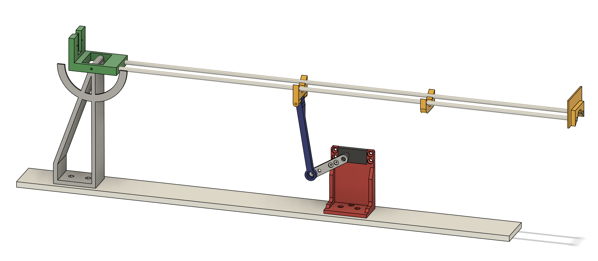

This system is inherently unstable—any slight tilt causes the ball to roll away from its desired position, accelerated by gravity. The further the beam tilts, the faster the ball moves, making stabilization increasingly difficult. To counteract this instability, a feedback control strategy is employed. In this project, a **Proportional-Integral-Derivative (PID) controller** is implemented to maintain the ball's position by continuously adjusting the beam angle based on real-time feedback from a distance sensor.  

---

## Repository Structure  

The repository is organized into the following directories:  

### 1. **Arduino/**  
This folder contains the Arduino code that is responsible for implementing the PID controller. The code reads real-time feedback from the Time-of-Flight (ToF) sensor and adjusts the angle of the beam via a servo motor to stabilize the ball.  

### 2. **Matlab/**  
This folder includes a MATLAB script for plotting the system's **Bode diagram**. The script helps analyze the system's frequency response and evaluate the stability and performance of the PID controller.  

### 3. **STL/**  
This folder contains all the 3D printable **STL files** required to build the physical components of the Ball and Beam system, including the beam, supports, and sensor mounts.
Each file in the STL folder requires one piece to be printed, except for the file clip, which requires two pieces.
 
---

## Components Required  

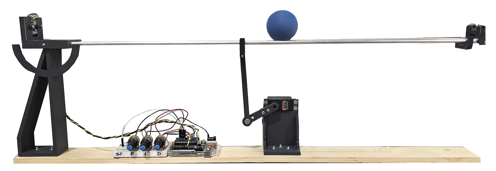

| Qty | Component               | Description                                                                | Image                                                                       |
|-----|-------------------------|----------------------------------------------------------------------------|-----------------------------------------------------------------------------|
|  1  | **VL530L1**             | Distance sensor with breakout board                                        | 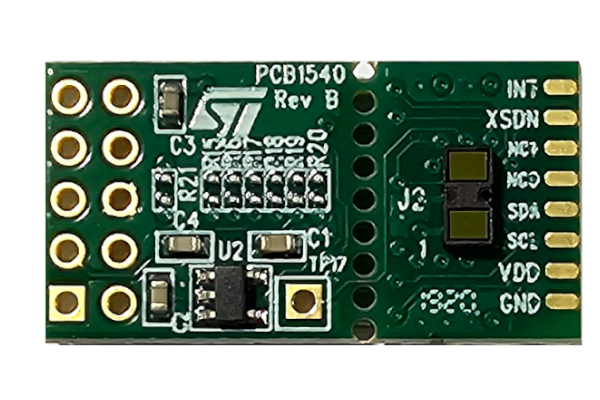  |
|  1  | **Servo Motor**         | Hitec HS-645MG is used to control the tilt of the beam                     | 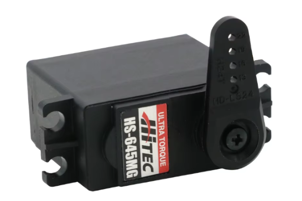  |
|  2  | **Aluminum bars**       | 5 mm diameter, 60 cm for the beam                                          | 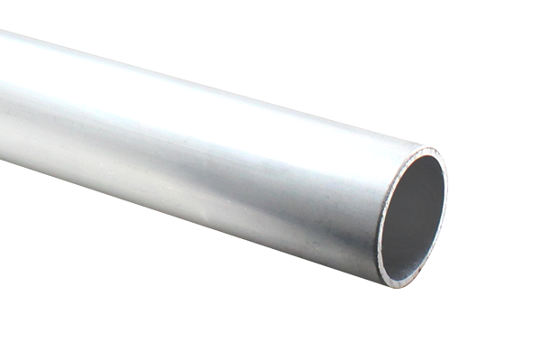  |
|  1  | **Arduino Uno**         | Microcontroller for PID implementation                                     | 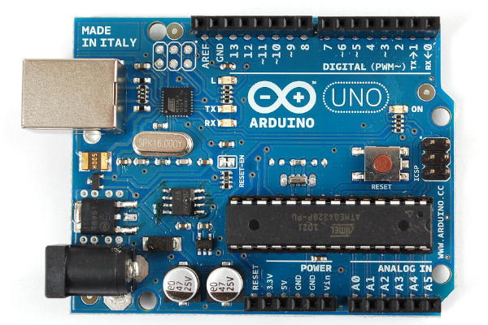  |
|  1  | **Breadboard**          | For connecting the circuit components                                      | 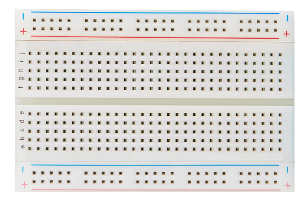  |
|  4  | **Potentiometer**       | For manual tuning of PID parameters                                        | 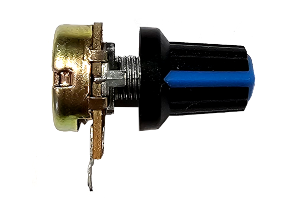  | 
| N/A | **Jumper Wires**        | For connecting components                                                  | 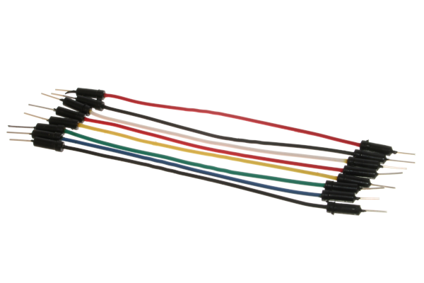  |
| 10  | **M4 Screws and Nuts**  | For assembling the system                                                  | 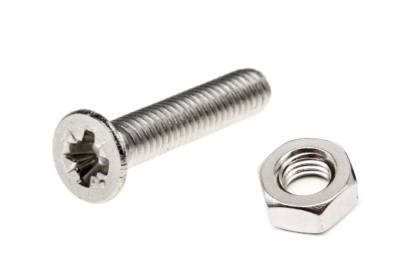  |
|  2  | **M2 Screws**           | To fix the ToF sensor through the two clips.                               | 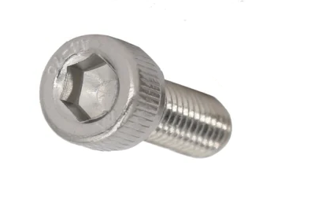  |
|  2  | **Aluminum Rod**        | 3 mm diameter, 5 cm length, solid cylindrical rod used as a fixing pin     | 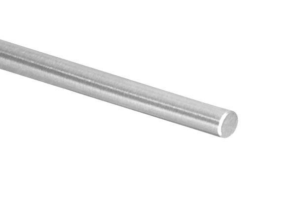  |
|  1  | **Bearing**             | Inner diameter 4 mm, outer diameter 10 mm, thickness 4 mm.                 | 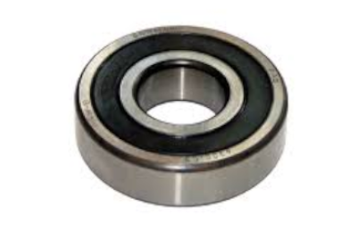  |

----

## Tools Required  

To assemble the Ball and Beam system, you will need the following tools:  

- **3D Printer**: Printing the components from the STL files in the `STL/` folder.  
- **Screwdrivers**: For assembling and securing the components.  
- **Drill and Drill Bits**: These are used to create/clean any holes required for mounting.  
- **Hacksaw**: This cuts the aluminum pipe and rod to the desired length.  
- **Wire Cutter (Tronchesina)**: For trimming jumper wires or cables.  
- **Pliers**: For holding components and securing nuts during assembly.

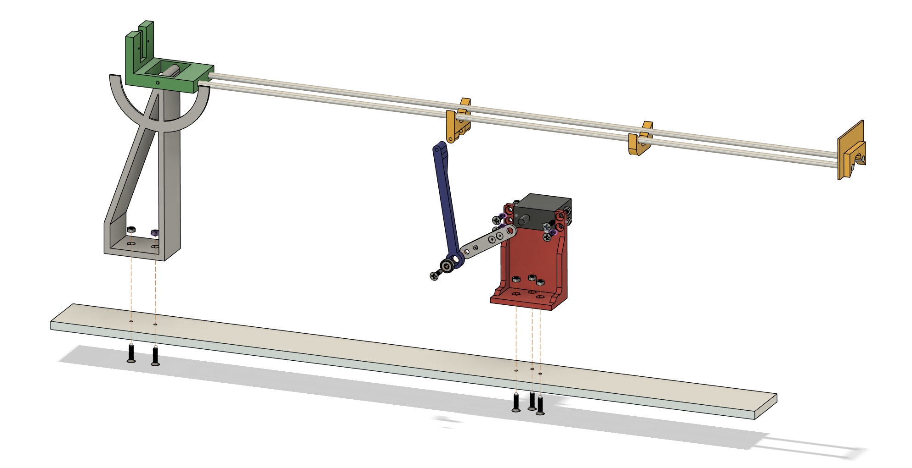

---

## How to Use This Repository  

1. **Build the Physical System**  
   - Use the STL files in the `STL/` folder to 3D print the necessary components.  
   - Assemble the system following the provided design and attach all components using the screws and nuts.

2. **Upload the Arduino Code**  
   - Connect the Time-of-Flight sensor, potentiomers, and servo motor to the Arduino.  
   - Upload the code from the `Arduino/` folder to the Arduino board.
   - The following libraries are required to run the system. They can be found at the links below:
      - [VL53L1X](https://github.com/peppegti/Adafruit_VL53L1X)
      - [Arduino-PID_v1](https://github.com/peppegti/Arduino-PID_v1)

3. **Analyze the System**  
   - Use the MATLAB script in the `Matlab/` folder to generate the Bode diagram and assess the system’s performance.  

---

## Contributing  

If you have suggestions for improvements or encounter any issues, feel free to submit a pull request or open an issue in this repository.  

---

## License  

This repository is licensed under the MIT License. By using, modifying, or distributing the code and resources in this repository, you agree to the terms and conditions outlined in the license file.

<!--
Please cite this work as:  

   <pre>
       @article{doe2023,
         title={Ball Beam System},
         author={Giuseppe Sutera},
         journal={xxxx Journal},
         year={2024},
         url={https://example.com/article}
       }
   </pre>

-->

@author Giuseppe Sutera giuseppe.sutera@unict.it 

Copyright (C) 2024

---

`Enjoy it while you can 🍾🍾➕ `
